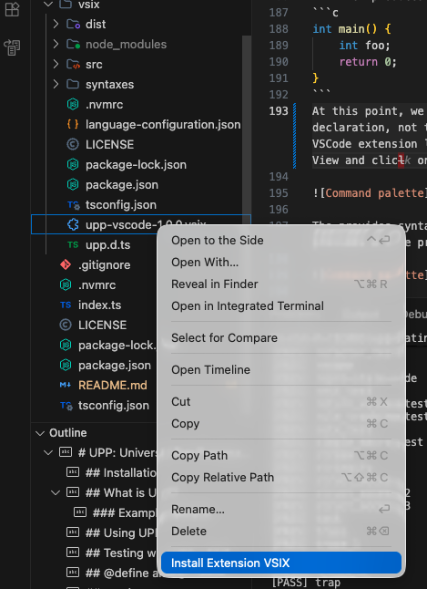
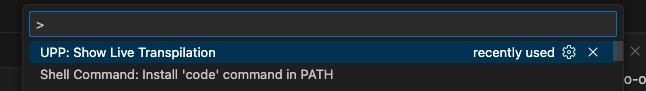
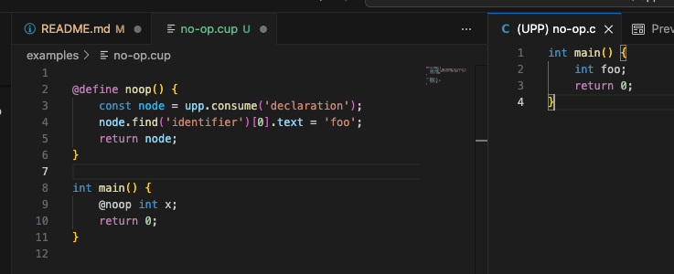

# UPP: Universal Pre-Processor

UPP is a meta-programming tool that allows you to define custom macros that can inspect the abstract syntax tree (AST) of your source code, modify it and generate new code. This enables features like struct methods, automatic defer, closures, and more, all in standard C.

## Installation

```
npm install -g @matatbread/upp
```

## What is UPP?

UPP is not a compiler. It is a pre-processor that generates C code (note: other languages are possible as the core engine is language agnostic). You can then compile the generated C code with a C compiler of your choice. 

### Example: `@trace`

The `@trace` macro decorates a function and automatically inserts a `puts` statement to print the function's name whenever it is entered. It uses `upp.consume()` to grab the function following the macro.

```c
#include <stdio.h>

@define trace() {
    // Read the next item in the AST and remove it from the tree
    const fnNode = upp.consume(); 
    const { returnType, name, params } = upp.getFunctionSignature(fnNode);
    const body = fnNode.childForFieldName('body');

    if (body) {
        // Return the modified function with an additional puts(...) statement
        return upp.code`
    ${returnType} ${name}${params} {
        puts("Entering ${name}\\n");
        ${body.children.slice(1, -1)}
    }`;
    }
}

@trace int my_function(int x) {
    int g = 1;
    for (int i=0; i < x; i++) {
        g = g * i;
    }
    return g;
}

int main() {
    printf("magic number %d\n", my_function(1));
    return 0;
}
```
You can compile and test in one go with the `--test` option:

```bash

$ upp --test examples/trace.cup
==== examples/trace.c ===
#include <stdio.h> // Actually, you'll see the full contents here, but that's a lot of text for an example!

int my_function(int x) {
    puts("Entering my_function\n");
    int g = 1;
    for (int i = 1; i < x; i++) {
        g = g * i;
    }
    return g;
} 
int main() {
    printf("magic number %d\n", my_function(10));
    return 0;
}

==== RUN OUTPUT ===
Entering my_function

magic number 362880
$ 
```


## Using UPP

The `--test` option is a handy way to see what upp macros have done to your code, and the related `--transpile` creates a .c file as well as showing you the result. however the main use-case for `upp` is as a wrapper for your C compiler of choice.

```bash
$ upp cc examples/trace.c
$ ./a.out
Entering my_function

magic number 362880
```

All the command line options you specify are passed to the C compiler (any C compiler: cc, gcc, clang), making UPP an incredibly simple "drop-in" replacement for your C compiler - just prefix the compilation commands in your build system with "upp ". When `upp` is invoked like this, it finds the .c files in the command line, and checks if there is a .cup file with the same name in the same directory. If there is, it will transpile the .cup file to a .c file, and then compile it with the C compiler, treating the resulting .c file as a build artifact. If there is not, it will just compile the .c file with the C compiler, assuming it's a source file. You build system will simply treat the generated .c files as your source, and continue as normal.

Typically, rather than define your macros in your C files, you'd put them in ".hup" files, and use `@include` to reference them.

## Testing with `upp --test`

UPP provides a unified test harness that can transpile, compile, and run your code in a single step. This is ideal for verification and regression testing. You can run it anywhere, but the `npm test` command looks for .cup files in the `examples/` directory and uses `--test` to compare them to their previous results (held in `test-results/`).

```bash
$ upp --test examples/my_test.cup
```

The output will include the materialized C code, compilation status, and the standard output of the executed program. This is the mechanism used by the UPP test suite to manage snapshots.

## @define and @include

The only built in macros are `@define` and `@include`. This allows you to create powerful, reusable abstractions across your project.

UPP comes with a small standard set of macros in the `std/` directory, such as `@expressionType`, `@defer`, `@fieldsOf`, `@lambda`, `@methods` and others. You can find out more about them (here)[docs/std.md]


## upp.json

The upp.json file defines where `upp` will look for your macros. By default, it contains

```json
{
    "comments": true, // Show what was replaced in a comment in the resulting .c file
    "includePaths": ["${UPP}/std"], // Paths to search for .hup files
    "core": [] // std macros to include by default
}
```

You can override these settings on a per-directory basis. The additional field `extends` is a relative path to another upp.json file which will be read in advance of the current one, and the current one will apply changes on top of it. Note that arrays are merged and de-duped.

## How to Write Macros

Macros are defined using the `@define` keyword. Within the definition body, you can write standard JavaScript. You are provided with:
1.  **Parameters**: Any arguments passed to the macro (e.g., `arg1`, `arg2`).
2.  **`upp`**: The magic helper object for navigating and manipulating the AST.
3.  **`console`**: Standard Node.js console for debugging.

UPP manipulates trees, rather than text. This means that many of the operations are akin to selecting an expression, statement or defintion, "cutting" it into a local variable, changing it and pasting it back.

The key features are:
* A macro can have arguments (in parentheses). These are just JavaScript values that get passed to your macro, so you can have `@castTo(int)` and `@castTo(char *)`. There's no typing or validation, they are just passed to your macro as JS strings.
* Macros are typically a *prefix* to your C code. This is because within a macro you can consume one or more AST "nodes", which in C can be an expression, a compound statement, a defintion or declaration, etc. You do this with the `upp.consume` helper. There is also a `upp.nextNode` that returns the next node but doesn't remove it from the source tree.
* The general flow is:
    - define a macro that consumes a node
    - manipulate the node
    - return it to be put back into the source tree
* The return value can be a node, an array of nodes, or a string
    - NB: using strings is easy, but error prone, and can cause weird interactions between macros as a declaration for an identifier like "x" could appear multiple times in your code and isn't a defintive C identifier. 
* The best way to return complex expressions is to use `upp.code`. This is Javascript "template" string builder that returns an AST representing your code, and crucially _**moves nodes without converting them to strings and back, so other macros can still see the node**_
> Using upp.code to move things around the tree is how multiple macros can manipulate the same tree and not lose references.
* There are special upp helpers for finding and manipulating nodes *outside* of the current node & sub-tree. These allow you to, for example, consume an identifier, find it's declaration and then all other references programmatically. UPP is clever enough to know whether to run your substitutions immediately (if they are a child of the current node, or on the "left" of the tree), or later, when it's transformation engine comes across the node anyway. This helps ensure that your macros are run at the right time in the right order.

### Manual tree manipulation

Here's a basic "no-op" macro:

```c
@define noop() {
    // Get the next node in the source and remove it from the tree
    const node = upp.consume(); 
    // Return the node so it replaces the macro invocation
    return node;
    // Note: `return node.text;` would work, but it returns the 
    // source text that would then be parsed into a NEW node. 
    // It would look the same in the output, _except_ if another 
    // macro was scheduled work on it later

}
```
`upp.consume` can take a list of node types, and it will report an error if the node doesn't match it (effectively warning the user of a syntax error).

Let's change `@noop` so it must be followed by a declaration, and make it change the name of declaration (declaration and identifier are tree-sitter labels. You can see [here](https://tree-sitter.github.io/tree-sitter/7-playground.html) what node names tree-sitter uses):

```c

@define noop() {
    // Read the next node from the AST, and throw
    // an error if it's not a declaration
    const node = upp.consume('declaration');
    node.find('identifier')[0].text = 'foo';
    return node;
}

int main() {
    @noop int x;
    return 0;
}
```
...which produces:
```c
int main() {
    int foo; 
    return 0;
}
```
At this point, we could pass the "foo" label as a parameter to the macro, so we have a general rename (for the declaration, not the references - `upp.withReferences` does that), but before we do, it's really useful to have the VSCode extension loaded. You can find this in `upp/vsix/upp-vscode-x.x.x.vsix`. Just right-click in the Explorer View and clicl on "Install VSIX".



Once installed, you can configure the file associated for .cup and .hup files to use the UPP Source and UPP Header respectively. You can do this by running the "Configure File Association" command from the command palette (Ctrl+Shift+P or Cmd+Shift+P).

But one of the most useful features is the _Live preview_



The provides syntax colouring for .cup and .hup files (which are a mixture of C and Javascript), but best of all provides a live preview, so you can quickly check your macros are working as expected:



You can find out more about the `upp.*` helpers [here](docs/helpers.md). And the `SourceNode` type is documented [here](docs/source-node.md).

Using the low-level SourceNode functions and properties is quite similar to writing DOM code for a browser. You're basically finding things in a tree and fiddling with the values or cutting bits out and pasting them elsewhere.

In fact the `node.text` property is very much like the HTMLElement.outerHtml property. You can get it to see the source code a node represents, and you can even set it and the node and it's children will be replaced with your source code. But like DOM nodes, doing so loses all the references to the children, since you've just replaced them all. Unless you know the modification is local and straightfoward, you might run in to problems whenb macros interact.

### Pattern matching to manipulate trees

Manual tree manipulation is powerful, but can be error prone and verbose. To make macros simpler to write, UPP has a pattern matcher that, like a regular expression, can "pull apart" a tree. It comes in a few forms (`upp.match`, `upp.withMatch`, etc), but works like this:

```c
    const node = upp.consume('declaration');
    const { type, name } = upp.match(node, "$type $name;");
    return upp.code`/* initialized: */ ${type} ${name} = (${type.text})0;`
```
As before, we're consuming a declaration, but this time we're matching against a code fragment and pulling out two matches called `type` and `name`. We then return the code to initialise the declaration, which will replace the consumed node:
```c
int main() {
    /* initialized: */
    int x = (int)0; 
    return 0;
}
```
Note: you have to be a bit careful. The above will create a bit of a mess if the declaration is already initialised. To avoid that you'd have to test the declaration for an initial value, and _not_ add another one in thst case (or raise an error). But the point remains - the general pattern is *match* nodes and map them to a replacement.

### `withMatches, withScope, withRoot, withNode,...`

These functions allow you to transform nodes *other* that the one following the macro.

The general form is:
```c
    upp.withMatches(node,"$code $pattern",
        ({ code, pattern /* the names of the captures in your source text following the $ */}, upp2) => {
            // code and pattern are SourceNode objects
            // upp2 is another instance of the helpers
            // Return a new node/source text/node array here will replace it in the original source tree.
            return upp2.code`${code} /* processed */ ${pattern}`;
        });
```
This will search from any node (for example `upp.root`, which `withRoot` uses) for the pattern, and for each one will call the callback with the captured nodes, and another instance of the helpers (so you can do further transforms if necessary). Returning a new node/source text/node array here will replace it in the original source tree.

The "magic" of the `withXxx` pattern is that it doesn't run your macro on all nodes immediately. Specifically, for nodes "above" the current node in the tree, the callbacks are deferred until the UPP transform engine recurses back up to the target node. In this way, UPP can minimize the amount of tree-traversal and manage the order to macro execution to maintain references.
