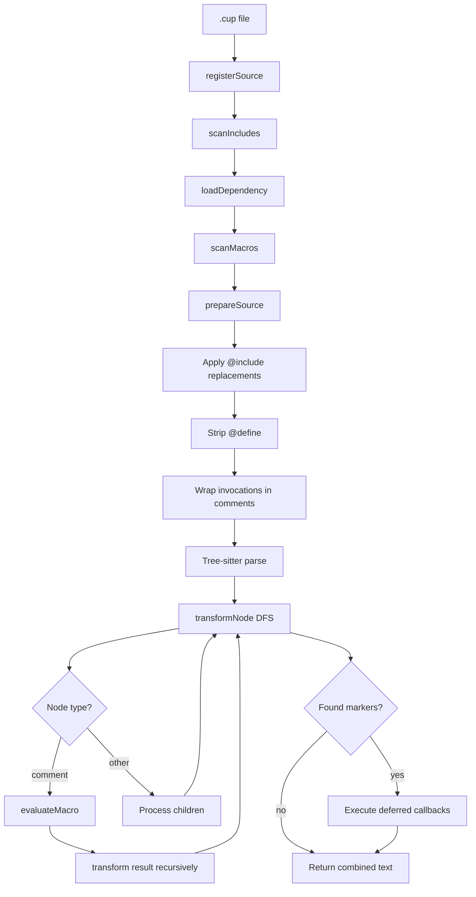

# Macro Processing in UPP

## Overview

UPP transforms C code with macro extensions into standard C through a multi-phase process that leverages Tree-sitter for parsing while working around its immutability constraints.

## Phase 0: C Preprocessor

**Input:** `.cup` file (C with UPP extensions)
**Output:** Preprocessed source with `#include`, `#define`, etc. expanded
**Tool:** Standard C preprocessor

The C preprocessor runs first to handle standard C directives. This is separate from UPP's macro system.

## Phase 1: First-Pass Macro Processing

**Goal:** Build global macro registry and prepare source for Tree-sitter parsing

### Step 1.1: `registerSource()` - Top-Down Macro Discovery

Called once per file to discover and register macros before any transformation.

**Order matters:**

```javascript
registerSource(sourceCode, filePath) {
    // 1. FIRST: Process @include (loads dependencies with @define macros)
    this.scanIncludes(sourceCode, filePath);

    // 2. SECOND: Scan for local @define macros
    const localMacros = this.scanMacros(sourceCode, filePath);
    for (const [name, macro] of localMacros) {
        this.macros.set(name, macro);
    }
}
```

#### `scanIncludes()` - Infrastructure Macro

Finds all `@include(file)` invocations:

1. **Loads dependency** - Calls `loadDependency(file)` which recursively processes the included file
2. **Generates C include** - Converts `@include(method.hup)` → `#include "method.h"`
3. **Stores replacement** - Maps position to replacement for later application

**Why first?** `@include` loads files containing `@define` macros, so it must run before `scanMacros()`.

#### `scanMacros()` - User Macro Discovery

Finds all `@define` patterns using regex:

```javascript
/@define(?:@(\w+))?\s+(\w+)\s*\(([^)]*)\)\s*\{/g
```

Extracts:
- Language tag (optional): `@define@c` → `'c'`
- Macro name: `allocate`
- Parameters: `size, type`
- Body: Everything between `{` and matching `}`

Registers each macro in `this.macros` Map.

### Step 1.2: `prepareSource()` - Source Cleanup

Transforms source to be Tree-sitter compatible:

```javascript
prepareSource(source) {
    let cleanSource = String(source);

    // 1. Apply @include replacements (from scanIncludes)
    //    @include(method.hup) → #include "method.h"
    for (const {start, end, key} of includeKeys) {
        const includeDirective = this.includeReplacements.get(key);
        cleanSource = cleanSource.slice(0, start) + includeDirective + cleanSource.slice(end);
    }

    // 2. Strip @define definitions (replace with spaces to preserve positions)
    while ((match = defineRegex.exec(cleanSource)) !== null) {
        const body = this.extractBody(cleanSource, match.index + match[0].length);
        const text = cleanSource.slice(range.start, range.end);
        const replacement = text.replace(/[^\r\n]/g, ' '); // Preserve line numbers
        cleanSource = cleanSource.slice(0, range.start) + replacement + cleanSource.slice(range.end);
    }

    // 3. Find remaining macro invocations
    const foundInvs = this.findInvocations(cleanSource);

    // 4. Wrap invocations in comments: @allocate(100) → /*@allocate(100)*/
    for (const inv of invsToWrap) {
        const invText = cleanSource.slice(inv.startIndex, inv.endIndex);
        const wrapped = `/*${invText}*/`;
        cleanSource = cleanSource.slice(0, inv.startIndex) + wrapped + cleanSource.slice(inv.endIndex);
    }

    return { cleanSource, invocations: foundInvs };
}
```

**Result:** Syntactically valid C code that Tree-sitter can parse into a stable AST.

**Example:**

```c
// Original
@include(method.hup)
@define allocate(size, type) { ... }
int* ptr = @allocate(100, int);

// After prepareSource
#include "method.h"
                                    // @define stripped (spaces preserve positions)
int* ptr = /*@allocate(100, int)*/;
```

## Phase 2: Depth-First Transformation

**Goal:** Process the AST depth-first, evaluating macros and applying transformations

We do this depth first. This means that when transforming a node, the node and any subtrees will have already been transformed, but is itself mutable: a transformation can change the node and any subtree. On the other hand, the ancestors are immutabl and may change macros invocations.

The fundamental rules are:
* If a node contains no macro invocations, it is returned unchanged.
* Tree sitter nodes are indices into the source text, and the source text is the source of truth.
* A transformation can change the current node and any sub-nodes. It can call upp.helpers.find*() to find other nodes to examine. If it needs to change an ancestor node, it must do so by calling upp.helpers.with*(), which queues the current node and target node together for later processing when we recurse back up to the target node.
* The current node and subtrees are mutable, and can be changed to a string, and via tree-sitter parsed into a new tree (invalidating all sub-nodes).
* All source modifications must be done through a central source modification API (eg static `SourceMarker.splice(....)`). This updates all source offsets, sizes and markers, and can warn when a marker has been invalidated.
* `SourceMarker` is a core system type which wraps a start/end pair of indices preventing inadvertant arithmetic and ensuring that source modifications are tracked correctly.
* Transformations themselves can return source containing further macro invocations. This is handled by recursively calling `transform()` on the returned source. The exceptions are it is NOT possible to define new macros by returning @define or @include directives (which are parsed before the DFT), and consequently these are pre-defined and implemented directly in phase 1.

The upp.helpers API is restricted as far as possible to read (findXxx) and write (withXxx) operations. Writes to subtrees are done by returning a new node (or string) from the transformation function. Writes are deferred (until the node is the target of the recursion) unless within the current subtree (in which case they are applied immediately).

### Step 2.1: `transform()` - Entry Point

```javascript
transform(source, originPath, parentHelpers) {
    const { cleanSource, invocations } = this.prepareSource(source);
    const tree = this._parse(cleanSource); // Tree-sitter parse

    if (isMain) {
        this.mainTree = tree; // Store for deferred callbacks
        this.invocations = invocations;
    }

    return this.transformNode(tree.rootNode, cleanSource, helpers, originPath);
}
```

### Step 2.2: `transformNode()` - Recursive DFS

Walks the AST depth-first, processing each node:

```javascript
transformNode(node, source, helpers, originPath) {
    // 1. Check if this is a comment node containing a macro invocation
    if (node.type === 'comment') {
        const text = node.text;
        if (text.startsWith('/*@') && text.endsWith('*/')) {
            const macroText = text.slice(2, -2); // Remove /* */
            const invocation = findMatchingInvocation(macroText);

            // Evaluate the macro
            const result = this.evaluateMacro(invocation, source, helpers, originPath);

            // Recursively transform the result
            return this.transform(result, `result-of-@${macroName}`, helpers);
        }
    }

    // 2. Check for deferred markers
    if (node.type === 'translation_unit' || node.type === 'compound_statement') {
        // Find markers like __UPP_DEFERRED_0__ in combined text
        // Execute deferred callbacks
    }

    // 3. Process children recursively
    const parts = [];
    for (let i = 0; i < node.childCount; i++) {
        const child = node.child(i);
        const childResult = this.transformNode(child, source, helpers, originPath);
        parts.push(childResult);
    }

    return parts.join('');
}
```

## The Marker System and Tree Immutability

### The Problem You Identified

**You're absolutely correct:** Adding markers to the source DOES modify the parent tree, which violates immutability!

```javascript
// upp.atRoot() returns a marker string
const marker = upp.atRoot((root, helpers) => { /* callback */ });
return `int x = 5; ${marker}`; // Macro returns: "int x = 5; __UPP_DEFERRED_0__"
```

When this result is inserted into the source:
1. The source text changes
2. Tree-sitter must re-parse to get updated node positions
3. Parent nodes become invalid (their byte ranges are wrong)

### Current Implementation Issues

**The marker system has fundamental problems:**

1. **Breaks immutability** - Inserting markers modifies source, invalidating parent nodes
2. **Requires re-parsing** - Every marker insertion needs a new parse to update positions
3. **Position tracking nightmare** - Must manually track how markers shift positions

### Why It "Works" Currently

The current implementation gets away with this because:

1. **Markers are only found during recursion unwind** - By the time we look for markers, we've already processed children
2. **We re-parse at scope boundaries** - When finding markers, we re-parse that scope's text
3. **Limited scope** - Markers are only inserted at specific boundaries (root, scope)

But this is fragile and inefficient!

## Alternative Approaches

### Option 1: Node ID Mapping (Recommended)

Instead of inserting markers into source, use a Map keyed by node IDs:

```javascript
// Instead of returning a marker string
atRoot(callback) {
    const nodeId = this.contextNode.id; // Tree-sitter node IDs are stable
    this.registry.deferredCallbacks.set(nodeId, {
        callback,
        targetType: 'root',
        context: { ... }
    });
    return ''; // Return empty string, no source modification
}
```

**Advantages:**
- No source modification
- No re-parsing needed
- True immutability
- Node IDs are stable within a tree

**Challenges:**
- Need to track which nodes have deferred callbacks
- Must walk tree to find nodes with callbacks during unwind

### Option 2: Replacement Map

Track replacements separately from source:

```javascript
class ReplacementTracker {
    constructor() {
        this.replacements = []; // [{start, end, content, deferred: callback}]
    }

    addReplacement(node, content, deferredCallback = null) {
        this.replacements.push({
            start: node.startIndex,
            end: node.endIndex,
            content,
            deferred: deferredCallback
        });
    }

    apply(source) {
        // Sort by position, apply all at once
        // Execute deferred callbacks when applying
    }
}
```

**Advantages:**
- Single re-parse at the end
- Clear separation of concerns
- Can optimize application order

**Challenges:**
- More complex state management
- Need to handle overlapping replacements

### Option 3: Two-Pass with Explicit Markers

Keep markers but make them explicit and tracked:

```javascript
// Pass 1: Collect all transformations and deferred callbacks
const transformations = [];
const deferredCallbacks = new Map();

transformNode(node) {
    // Record transformations, don't apply
    transformations.push({node, replacement});

    // Record deferred callbacks by node
    if (needsDeferred) {
        deferredCallbacks.set(node.id, callback);
    }
}

// Pass 2: Apply all transformations at once
const newSource = applyTransformations(source, transformations);
const newTree = parse(newSource);

// Pass 3: Execute deferred callbacks on new tree
for (const [nodeId, callback] of deferredCallbacks) {
    const node = findNodeById(newTree, nodeId);
    callback(node);
}
```

## Recommendation

**I strongly recommend Option 1 (Node ID Mapping)** because:

1. **Preserves immutability** - No source modifications during transformation
2. **Efficient** - No intermediate re-parsing
3. **Simpler** - Cleaner mental model
4. **Aligns with Tree-sitter** - Works with, not against, immutability

The current marker system is a workaround that happens to work but fights against Tree-sitter's design. Moving to node ID mapping would be more robust and performant.

## Current Flow Diagram



## Key Insights

1. **First-pass macros** (`@include`, `@define`) must run top-down before DFS
2. **Tree-sitter immutability** is both a constraint and a design principle we should embrace
3. **Marker system** is a hack that works but violates immutability
4. **Node ID mapping** would be a cleaner, more efficient solution
5. **Re-parsing is expensive** - We should minimize it by batching transformations

## Questions to Consider

1. Should we refactor to use node ID mapping instead of markers?
2. Can we batch all transformations and apply them in a single pass?
3. Is there value in keeping the current marker system for backwards compatibility?
4. How do we handle the transition if we change the deferred callback mechanism?
